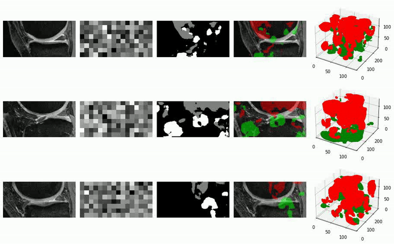

# LDSeg
This is the official repository of LDSeg from the paper "Latent Diffusion for Medical Image Segmentation: End to end learning for fast sampling and accuracy".

## Installation
1. Create a virtual environment `conda create -n ldseg python=3.10 -y` and activate it `ldseg`
2. Install [Tensorflow 2.0](https://www.tensorflow.org/install/pip)
3. git clone `https://github.com/FahimZaman/LDSeg.git`
4. Enter the LDSeg `cd LDSeg` and run `pip install -r requirements.txt`


## Dataset
We have used three datasets in the paper:
1. Echo (2D+t)
2. [GlaS (2D)](https://www.kaggle.com/datasets/sani84/glasmiccai2015-gland-segmentation) 
3. [knee (3D)](https://nda.nih.gov/oai/):

For demo purpose, few examples of source images, label images and the model weights of the GlaS dataset are added in the 'data' directory.

## Model Architecture


The model contains four components which are trained in an end-to-end strategy:
1. Label encoder
2. Image encoder
3. Denoiser
4. Label decoder

The label encoder produces the label embedding $z_{l(0)} = f_{label-enc}(y)$ and the image encoder produces image embedding $z_i = f_{image-enc}(X)$, given an Image $X$ and it's corresponding label image $y$.
A Gaussian block is used to get the perturbed label embedding $z_{l(t)} = \mathcal G(z_{l(0)}, t)$, given noise variance schedulers $\alpha$ and $\beta$ for timestep $t \in (1 \dotsc T)$.
The denoiser/score model learns the noise variances of label embedding for the transition states and predicts noise $z_{n(t)}$ for timestep $t \in (1 \dotsc T)$.
The denoised latent space $z_{dn}$ is mapped to segmentation $\hat{y}$ using the label decoder. Our training objective is to learn, ![q(\hat{y}|X)=\mathbb{E}_{q_{i}(z_{i}|X)}\left[q_{s}(\hat{y}|z)\right]](https://latex.codecogs.com/png.latex?q%28%5Chat%7By%7D%7CX%29%3D%5Cmathbb%7BE%7D_%7Bq_%7Bi%7D%28z_%7Bi%7D%7CX%29%7D%5Cleft%5Bq_%7Bs%7D%28%5Chat%7By%7D%7Cz%29%5Cright%5D) where $q_{l}(z \mid y, X) \sim \mathcal{N}(z_{dn}, \sigma^2 \mathrm{I})$.


In the inference phase, image embedding is obtained first using the image encoder, and then the Denoiser is iterated for $t = T \cdots 1$ to obtain }), staring with }) as a Gaussian random noise $(\mathcal{N}(\mathrm{0, I}))$. Finally, the trained label decoder is used to get the final segmentation $\hat{y}$.

## Model Training/Inference
The model can be configured using the cfg.ini file (Instructions are given in the cfg.ini). To run the model for training/inference, use the LDSeg.py file.

```bash
python3 LDSeg.py
```

## Results
A few examples of segmentation are given below for the Echo, GlaS and Knee datasets. Top row shows the source images/mmageslices, 2nd and 3rd row shows the reverse diffusion for the latent space and the segmentation outputs. The bottom layer shows the segmentations overlay on the source images.

--------------------

### <ins> <p align='center'> Echo </ins>


<br/>

### <ins> <p align='center'> GlaS </ins>


<br/>

### <ins> <p align='center'> Knee </ins>



--------------------

## Robustness to noises
An example from each dataset is shown to demonstrate the model robustness to noise. Here, $\sigma$ is the variance of the added noise to the source image. DSC is the Dice Similarity Co-efficient score for the image (2D/3D). For the Knee dataset, a randomly selected slice is shown for convenience.

--------------------

### <ins> <p align='center'> Echo </ins>


<br/>

### <ins> <p align='center'> GlaS </ins>


<br/>

### <ins> <p align='center'> Knee </ins>


--------------------

## Acknowledgements
- This research was supported in part by NIH Grants R01HL171624, R01AG067078 and R01EB019961.
- The OAI is a public-private partnership comprised of five contracts (N01-AR-2-2258; N01-357 AR-2-2259; N01-AR-2-2260; N01-AR-2-2261; N01-AR-2-2262) funded by the National Insti-358 tutes of Health, a branch of the Department of Health and Human Services, and conducted by the359 OAI Study Investigators. Private funding partners include Merck Research Laboratories; Novartis360 Pharmaceuticals Corporation, laxoSmithKline; and Pfizer, Inc. Private sector funding for the361 OAI is managed by the Foundation for the National Institutes of Health. This manuscript was362 prepared using an OAI public use data set and does not necessarily reflect the opinions or views of363 the OAI investigators, the NIH, or the private funding partners.
- We also thank Aakash Kumar Nain for his DDPM implementation (https://keras.io/examples/generative/ddpm/) which is used as a base for our diffusion models.


## References

1. Ho, Jonathan, Ajay Jain, and Pieter Abbeel. "Denoising diffusion probabilistic models." Advances in neural information processing systems 33 (2020): 6840-6851.
2. Song, Jiaming, Chenlin Meng, and Stefano Ermon. "Denoising diffusion implicit models." arXiv preprint arXiv:2010.02502 (2020).


## citation

```
@misc{zaman2024denoisingdiffusionslatentspace,
      title={Denoising Diffusions in Latent Space for Medical Image Segmentation}, 
      author={Fahim Ahmed Zaman and Mathews Jacob and Amanda Chang and Kan Liu and Milan Sonka and Xiaodong Wu},
      year={2024},
      eprint={2407.12952},
      archivePrefix={arXiv},
      primaryClass={cs.CV},
      url={https://arxiv.org/abs/2407.12952}, 
}
```
